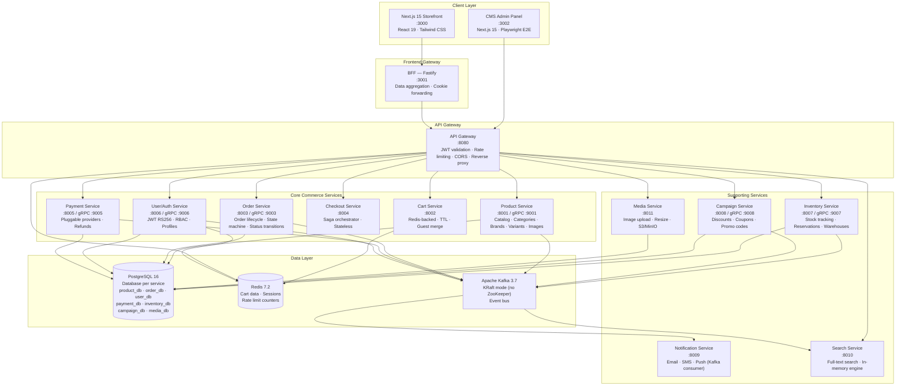
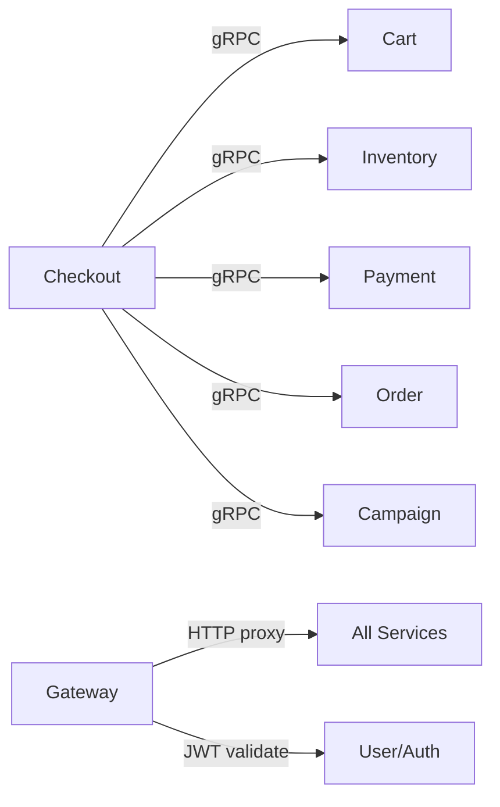
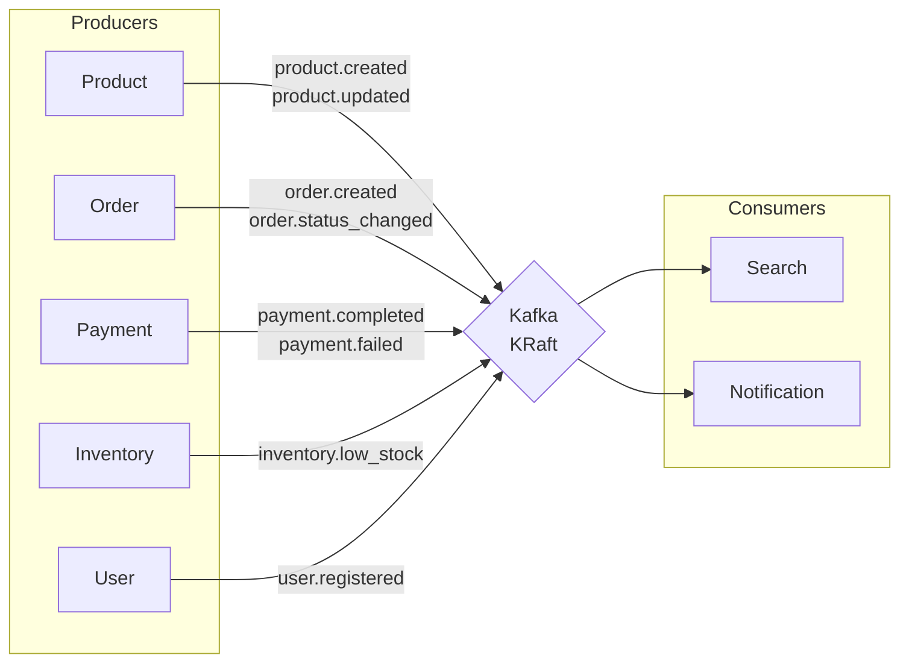
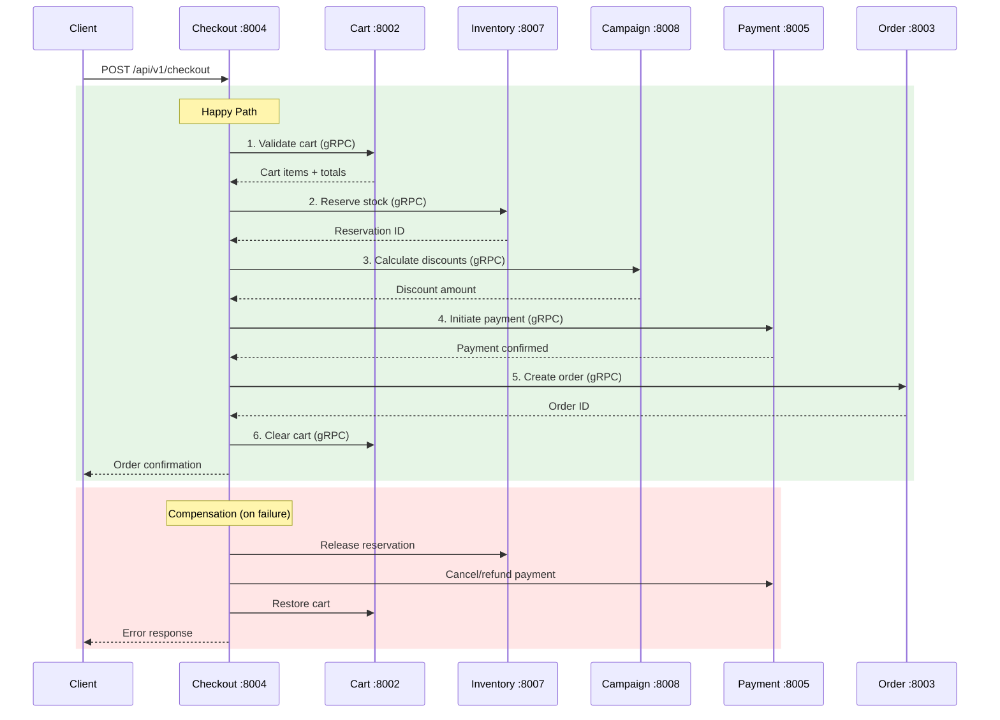
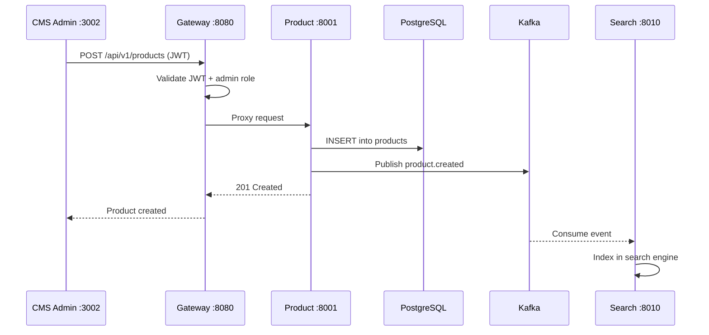
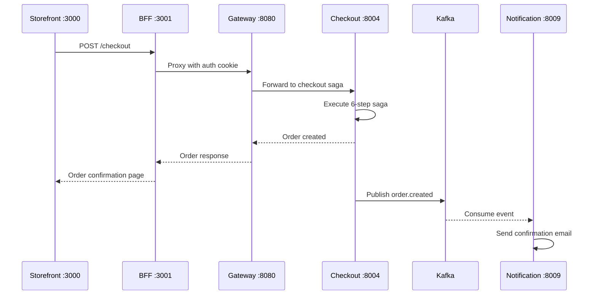
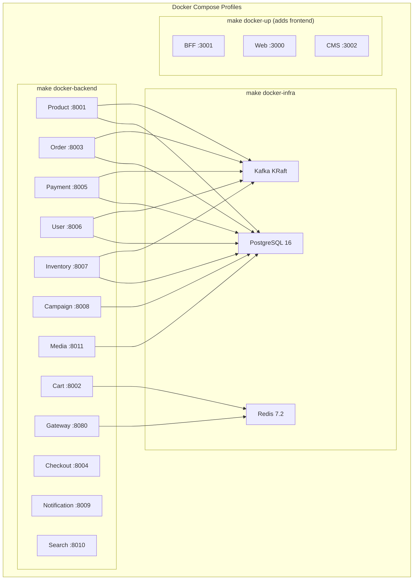

# Architecture Overview

## System Architecture

EcommerceGo is a microservices-based e-commerce platform following domain-driven design principles. Built with Go 1.23+, TypeScript BFF (Fastify), and Next.js 15 frontend.

## Design Principles

1. **Database per Service**: Each microservice owns its data. No shared databases. Cross-service data access is via APIs or events only.
2. **Event-Driven**: Services communicate asynchronously via Kafka events following the envelope format in `pkg/kafka/event.go`.
3. **gRPC for Sync Calls**: When synchronous calls are needed (checkout saga), services use gRPC. Protobuf contracts managed via `buf` CLI.
4. **API Gateway**: Single entry point handles JWT validation, rate limiting (Redis-backed), CORS, and reverse proxying to backend services.
5. **BFF Pattern**: Frontend-specific data aggregation layer between Next.js storefront and backend services. Handles cookie forwarding and response shaping.
6. **Money in Cents**: All monetary values stored and transmitted as `int64` cents. Never `float64`. Frontend handles display formatting.
7. **UUIDs Everywhere**: All entity IDs are UUIDs generated at creation time. No auto-increment integers in APIs.
8. **Product Service as Reference**: When building any new service, study `services/product/` for the canonical layer structure.

## Service Port Map

| Service | HTTP | gRPC | Database | Key Tech |
|---------|------|------|----------|----------|
| Gateway | 8080 | — | — | chi router, JWT, rate limit |
| Product | 8001 | 9001 | product_db | PostgreSQL, Kafka producer |
| Cart | 8002 | — | Redis | go-redis, TTL, JSON serialization |
| Order | 8003 | 9003 | order_db | State machine, event sourcing |
| Checkout | 8004 | — | — | Saga orchestrator, stateless |
| Payment | 8005 | 9005 | payment_db | Pluggable provider interface |
| User/Auth | 8006 | 9006 | user_db | JWT RS256, bcrypt, RBAC |
| Inventory | 8007 | 9007 | inventory_db | Stock reservations, warehouses |
| Campaign | 8008 | 9008 | campaign_db | Promo engine, code validation |
| Notification | 8009 | — | — | Kafka consumer, email/SMS |
| Search | 8010 | — | In-memory | Full-text search, ranking |
| Media | 8011 | — | media_db + S3 | Image upload, resize, CDN |
| BFF | 3001 | — | — | Fastify, TypeScript, Zod |
| Web | 3000 | — | — | Next.js 15, React 19, Tailwind |
| CMS | 3002 | — | — | Next.js 15, Admin panel |

## Communication Patterns

### Synchronous (gRPC / HTTP)

Used when a service needs an immediate response:

### Asynchronous (Kafka Events)

Used for eventual consistency and decoupled flows:

## Checkout Saga

The checkout flow uses the **orchestration saga pattern**. The Checkout Service (`:8004`) is a stateless orchestrator with no database.

## Data Flow Examples

### Product Creation (Admin CMS)

### Order Placement (Customer)

## Deployment Architecture

## Security

- **Authentication**: JWT-based (RS256) via User/Auth service
- **Authorization**: Role-based access control (customer, admin, seller)
- **Rate Limiting**: Redis-backed per-IP rate limiting at gateway level
- **Input Validation**: `go-playground/validator` on every endpoint, Zod in BFF
- **SQL Safety**: Parameterized queries only (`pgx/v5`), no string concatenation
- **CORS**: Policy enforcement at gateway level
- **Security Headers**: X-Frame-Options, X-Content-Type-Options, Referrer-Policy (CMS middleware)
- **Container Security**: Distroless final images, non-root users, read-only filesystems
- **Secrets**: Environment-injected, never committed. Kubernetes Secrets in production.

## Testing Strategy

| Layer | Tool | Count | Coverage |
|-------|------|-------|----------|
| Go Unit Tests | testify + table-driven | 300+ | 80%+ service layer |
| Go Integration | testcontainers-go | Per service | DB + Kafka |
| CMS E2E | Playwright | 96 tests | 7 modules (auth, products, orders, campaigns, inventory, categories/brands, dashboard) |
| Frontend E2E | Playwright | Per flow | Checkout, PLP, PDP |
| Load Testing | k6 | Scripts | Gateway throughput |

## Shared Go Packages (`pkg/`)

| Package | Purpose |
|---------|---------|
| `pkg/logger` | Structured slog JSON logger with correlation ID |
| `pkg/database` | PostgreSQL connection pool + auto-migration |
| `pkg/kafka` | Producer/consumer with event envelope format |
| `pkg/middleware` | RequestID, Logging, Recovery, Auth, RequireRole |
| `pkg/errors` | Typed app errors (NotFound, InvalidInput, etc.) |
| `pkg/health` | Health check HTTP handlers (/health/live, /health/ready) |
| `pkg/config` | Environment variable binding via caarlos0/env |
| `pkg/validator` | Input validation wrapper around go-playground/validator |
| `pkg/pagination` | Paginated query helpers and response types |
